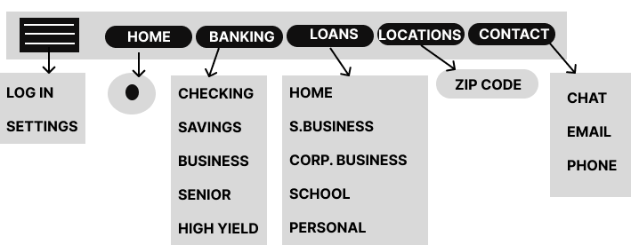

# Project-2
Project 2 - HTML file 
<!DOCTYPE html>
<html lang="en">
<head>
    <meta charset="UTF-8">
    <meta name="description" content="Banking Website for Private Clients">
    <meta name="Dornishia Cunningham" content="Banking Interface">
    <meta name="viewport" content="width=device-width, initial-scale=1.0">
    <title>Document</title>
</head>
<body>
    <h1> Project Proposal </h1>
    
    <h4>The critical goal of this project is to make banking with <em><b>NOVO</b></em> easy. 
        The interface will display remarkable products and services that
         will make banking and finace easy for clients through navigating and 
         thoroughly understanding what the company offers.
        I aim to highlight a number of issues that can be adjusted to help 
         users have an easy and informative browsing experience such as an easy navigation bar,
         Images to explain text, and very minimal design. despite the level of technical
         expertise, each customers browsing experience will be easy.</h4>
    
 The interface design <em><b>must be clean & minimalist</b></em>

    

    <h2><u>Concept</u></h2>
    
 The client suggest a clean banking interface that answers users questions regarding products and services
        that NOVO offers. In addition, the logo royal blue color must be added throughout the pages with black bold text. banking images 
        with the logo colors are also to be added. The client emphasis that the webpage must look clean and not overcrowded.  

    <h2><u> Site Map  </u></h2>
    
 This site map is structured based on a list of reasons why users visit banking webistes. 
        There are five tabs total in the tool bar, however, only four will display at a time, illliminating the tab 
        for the screen the user is currenty in. 
  
    <ul>
        <li>Home</li>
        <li>Banking</li>
        <li>Loans</li>
        <li>Locations</li>
        <li>Contact Us</li>
    </ul>
    
    <h2><u> Wireframe </u></h2>
    
 The website will display a layout thats easy for users to scroll and retain information. ALl text, Images and buttons will
        be placed horizontally to be made clear to users. We designed two homepages for the client to decide which is more appealing 
        and to see how each would trascend on other devices.
    

    
    <h2> <u>Project Resources </u> </h2>
    
 Here are a list of financial resources such as Bank Of America with a large group of users 
        and American Eagle with a smaller group of users. Both interfaces will aid in the development of recreating the new 
        Novo website.The links below highlights different color schemes, finacial content and layouts that will make the 
        Novo website complete. 

        <h3> Bank Of America displays a well thoughtout interface which appeals to a large number of users. The Site Map and subtitles
            in particular will help with the Nova Design process.  </h3>
        <a href="https://www.bankofamerica.com"><b>Bank Of America</b></a> 
         
        <h3> We will refer to the minimalist design and color concept from the American Eagle Bank site
            while developing the new Novo interface. </h3>
        <a href="https://www.americaneagle.org"><b>American Eagle Bank</b></a>
        <h3> Review the Concept again for client proposal notes </h3> 
        <a href="#Concept"><b>Concept</b></a>
</body>
</html>
